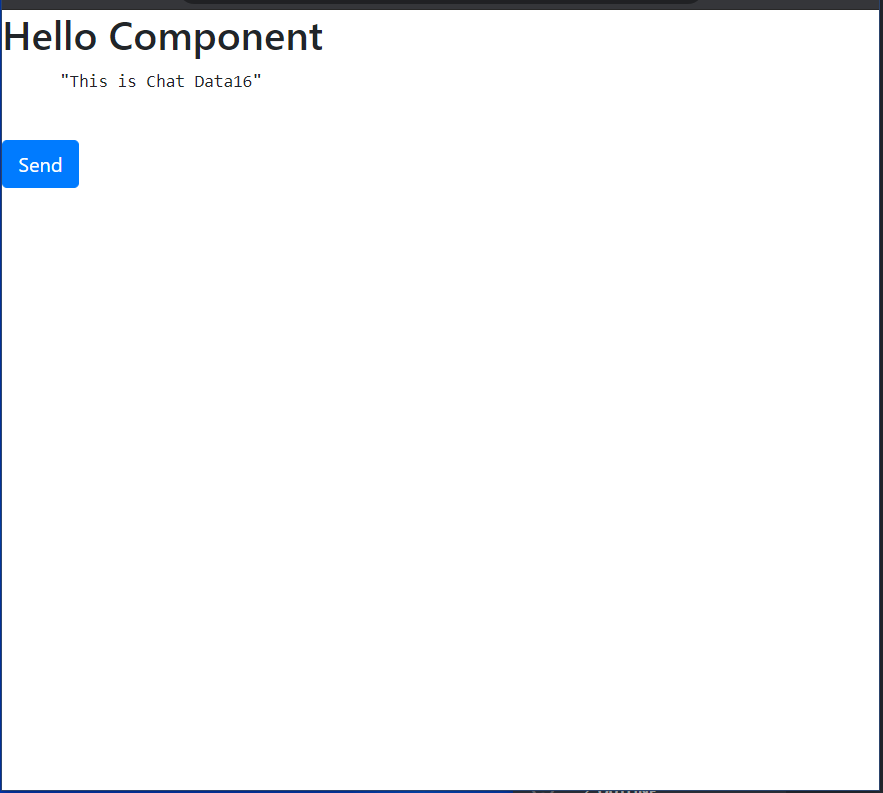

# Angular Node Socket Demo

Simple Demo to Connect Angular App to NodeJS Web Socket Server.

## Technologies

- Client - `Angular`, `ngx-socket-io`
- Server - `NodeJS`, `ExpressJS`, `socket.io`

## Resources

- [Alligator Refrence Article](https://alligator.io/angular/socket-io/)
- [GitHub Repo Link](https://github.com/alligatorio/socket-example)

## Preview

